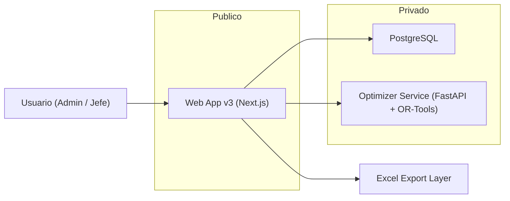

# Diseño Técnico Pre-Construcción v3

Este documento traduce el [documento funcional v3](C:/Users/DaniloPrieto/OneDrive%20-%20pompeyo.cl/RRHH%20-%20Documentos/Patricio%20Diaz/Danilo/Proyectos%20-%20Antigravity/shift-optimizer/docs/v3-functional-foundation.md) a una propuesta técnica concreta de implementación.

El objetivo es definir la arquitectura, los módulos, el modelo de datos, los flujos principales y las reglas técnicas de `v3` antes de escribir código.

---

## 1. Objetivo técnico

`v3` debe resolver lo mismo que `v2`, pero con una arquitectura más clara y más fácil de operar:

- una sola aplicación web pública
- una sola base de datos transaccional propia
- un servicio privado de optimización
- sin Appwrite como centro del sistema
- frontend similar en esencia a `v1/v2`

La idea es conservar la lógica de negocio útil y bajar fuertemente la complejidad operativa.

---

## 2. Principios técnicos

### 2.1. Una sola fuente de verdad

`PostgreSQL` será la fuente de verdad de:

- usuarios
- sucursales
- trabajadores
- restricciones
- catálogos
- calendarios
- propuestas
- asignaciones
- overrides
- auditoría

### 2.2. Un solo backend público

La app `Next.js` será el backend público del producto:

- login
- autorización
- importación Excel
- CRUD de negocio
- generación de calendarios
- asignación de trabajadores
- overrides
- exportación

El navegador no hablará directo con la base de datos.

### 2.3. Python solo para el motor

El servicio Python existirá solo para:

- `optimize`
- `validate`
- operaciones matemáticas del solver

No será el dueño principal de auth, UI, catálogos ni persistencia.

### 2.4. Frontend familiar

El frontend de `v3` debe ser similar en esencia a `v1/v2`:

- misma lógica mental
- misma navegación principal
- misma idea de sucursales, calendario mensual, proposals, slots y exportación

No se busca rediseñar el producto desde cero. Se busca limpiarlo por dentro.

### 2.5. Mínimas piezas móviles

Para el MVP de `v3` no se propone:

- BaaS
- cola distribuida
- microservicios adicionales
- cache distribuida
- múltiples fuentes de autenticación

Arquitectura base:

- `Next.js`
- `PostgreSQL`
- `FastAPI` solver
- `Docker Compose`
- `Nginx`

---

## 3. Arquitectura propuesta

### 3.1. Responsabilidades por componente

#### Web App v3

Responsable de:

- login y logout
- control de sesiones
- permisos por rol
- panel admin
- panel jefe
- importación y sincronización desde Excel
- clasificación inicial de sucursales
- lectura y escritura de calendario
- invocar motor de plantilla o solver
- asignación trabajador real a slot
- overrides
- exportación

#### PostgreSQL

Responsable de:

- persistencia completa del dominio
- integridad relacional
- auditoría
- historial de propuestas y calendarios

#### Optimizer Service

Responsable de:

- resolver sucursales con operación dominical
- validar propuestas
- devolver diagnóstico de insuficiencia

No guarda estado propio.

---

## 4. Stack propuesto

### 4.1. Web

- `Next.js` App Router
- `React`
- `TypeScript`
- `Tailwind`
- componentes UI similares a `v1/v2`

### 4.2. Backend dentro de la web

- Route Handlers / Server Actions para lógica de aplicación
- parsing de Excel server-side
- exportación server-side

### 4.3. Base de datos

- `PostgreSQL`

### 4.4. Optimización

- `Python 3.11+`
- `FastAPI`
- `OR-Tools`

### 4.5. Infraestructura

- `Docker Compose`
- `Nginx`

---

## 5. Decisión de frontend

El frontend debe mantener la esencia de `v1/v2`.

### 5.1. Qué se conserva

- login simple
- separación admin / jefe
- listado de sucursales
- ficha de sucursal
- calendario mensual central
- proposals
- slots anónimos `Trabajador 1..N`
- panel de asignación manual
- exportación desde la misma vista

### 5.2. Qué no se busca

- rediseño visual radical
- nueva lógica de navegación
- nueva metáfora de uso

### 5.3. Rutas recomendadas

- `/login`
- `/admin`
- `/admin/sucursales`
- `/admin/sucursales/[branchId]`
- `/admin/sucursales/[branchId]/mes/[year]/[month]`
- `/admin/importaciones`
- `/admin/restricciones`
- `/jefe`
- `/jefe/sucursales/[branchId]/mes/[year]/[month]`

---

## 6. Modelo de dominio técnico

Se recomienda un modelo relacional explícito.

### 6.1. Tablas principales

#### `users`

- `id`
- `email`
- `password_hash`
- `full_name`
- `role` (`admin`, `jefe_sucursal`)
- `active`
- timestamps

#### `sessions`

- `id`
- `user_id`
- `session_token_hash`
- `expires_at`
- `created_at`

#### `branch_types`

- `id`
- `code`
- `name`
- `area` (`ventas`, `postventa`)
- `generation_mode_default` (`rotativo_2`, `rotativo_4`, `solver`)
- `operates_sunday`
- `description`
- `active`

Esta tabla reemplaza la lógica difusa de `tipo_franja` como centro técnico.

#### `branches`

- `id`
- `codigo_area`
- `name`
- `branch_type_id`
- `generation_mode`
- `first_classified_at`
- `first_classified_by`
- `active`
- `created_from_import`
- timestamps

#### `branch_manager_assignments`

- `id`
- `branch_id`
- `user_id`
- `assigned_from`
- `assigned_to`

#### `workers`

- `id`
- `branch_id`
- `rut`
- `full_name`
- `area_negocio`
- `active`
- `last_import_batch_id`
- timestamps

#### `worker_constraints`

- `id`
- `worker_id`
- `type` (`vacaciones`, `dia_prohibido`, `turno_prohibido`)
- `value`
- `date_from`
- `date_to`
- `notes`
- `created_by`
- timestamps

#### `holidays`

- `id`
- `date`
- `name`
- `type`
- `year`

#### `shift_templates`

- `id`
- `code`
- `name`
- `branch_type_id`
- `labor_hours`
- `discount_break`
- `active`

Define los turnos base reutilizables.

#### `shift_template_days`

- `id`
- `shift_template_id`
- `weekday` (`lunes..domingo`)
- `start_time`
- `end_time`
- `is_off`

Permite representar turnos con distinta hora por día.

#### `schedule_patterns`

- `id`
- `code`
- `name`
- `branch_type_id`
- `cycle_length_weeks`
- `active`

Ejemplos:

- patrón `2 semanas`
- patrón `4 semanas`

#### `schedule_pattern_phases`

- `id`
- `schedule_pattern_id`
- `phase_index`
- `name`

#### `schedule_pattern_phase_days`

- `id`
- `phase_id`
- `weekday`
- `shift_template_id`
- `is_off`

Esta es la formalización real de la plantilla de 4 semanas.

#### `branch_slots`

- `id`
- `branch_id`
- `slot_number`
- `pattern_seed_phase`
- `active`
- `archived_at`

Esta tabla es muy importante.

Los slots anónimos no deben vivir solo dentro de una propuesta. Deben existir como entidad persistente por sucursal.

Eso permite:

- continuidad
- proyección
- asignación estable
- overrides más claros

#### `schedule_generations`

- `id`
- `branch_id`
- `year`
- `month`
- `visible_start`
- `visible_end`
- `effective_start`
- `effective_end`
- `engine_used` (`template`, `solver`)
- `status`
- `diagnostic_json`
- `created_by`
- timestamps

Representa una corrida de generación.

#### `schedule_proposals`

- `id`
- `generation_id`
- `proposal_number`
- `score`
- `is_feasible`
- `status` (`generada`, `seleccionada`, `descartada`, `exportada`)
- `created_by`
- `selected_by`
- timestamps

#### `schedule_entries`

- `id`
- `proposal_id`
- `branch_slot_id`
- `date`
- `shift_template_id`
- `source` (`template`, `solver`, `manual`)
- `is_off`

Una fila por slot y día.

#### `slot_assignments`

- `id`
- `proposal_id`
- `branch_slot_id`
- `worker_id`
- `assigned_by`
- `assigned_at`

En `v3`, la asignación real de persona a slot es mensual por propuesta.

#### `slot_overrides`

- `id`
- `proposal_id`
- `branch_slot_id`
- `date`
- `override_type`
- `original_shift_template_id`
- `new_shift_template_id`
- `notes`
- `created_by`
- timestamps

#### `import_batches`

- `id`
- `filename`
- `import_type`
- `uploaded_by`
- `status`
- `summary_json`
- timestamps

#### `audit_logs`

- `id`
- `actor_user_id`
- `action`
- `entity_type`
- `entity_id`
- `metadata_json`
- `created_at`

---

## 7. Regla técnica de clasificación inicial

Cuando se importa Excel:

1. se crean o actualizan sucursales y trabajadores
2. si una sucursal no tiene `branch_type_id` o `generation_mode`, queda como `pending_classification`
3. el admin debe clasificarla una sola vez
4. esa clasificación queda persistida
5. futuras importaciones no la pisan

Esto debe implementarse como flujo técnico explícito, no como convención manual.

---

## 8. Motor de generación por plantillas

### 8.1. Cuándo se usa

Se usa cuando la sucursal tiene `generation_mode`:

- `rotativo_2`
- `rotativo_4`

### 8.2. Entrada

El motor necesita:

- sucursal
- branch type
- pattern seleccionado
- slots activos de la sucursal
- período visible del mes
- período efectivo extendido a semanas completas
- restricciones individuales
- feriados
- contexto previo aprobado

### 8.3. Regla de slots

La cantidad de slots activos de una sucursal debe igualar la cantidad de trabajadores activos.

Si la dotación aumenta:

- se crean nuevos `branch_slots`

Si la dotación disminuye:

- los últimos slots se archivan

### 8.4. Reparto inicial por fases

Los slots deben distribuirse de forma balanceada entre fases del patrón.

Regla:

- diferencia máxima entre grupos = `1`

Ejemplos:

- 9 slots en patrón A/B → `5` y `4`
- 10 slots en patrón de 4 fases → `3`, `3`, `2`, `2`

### 8.5. Continuidad técnica

Cada `branch_slot` debe mantener su semilla de fase (`pattern_seed_phase`).

Luego, al calcular un mes:

- se determina la semana efectiva inicial
- se calcula el desplazamiento dentro del ciclo
- se aplica la fase correcta a cada slot en cada semana

Esto evita perder continuidad cuando cambia el mes.

---

## 9. Motor solver

### 9.1. Cuándo se usa

Solo en sucursales cuya clasificación indique operación dominical.

No se usa en rotativos normales.

### 9.2. Arquitectura de llamada

Flujo recomendado:

1. navegador solicita generar mes
2. `Next.js` carga datos de PostgreSQL
3. `Next.js` construye payload técnico
4. `Next.js` llama al servicio Python por red privada
5. Python devuelve propuestas y diagnóstico
6. `Next.js` persiste propuestas en PostgreSQL

El navegador no debe llamar directo al servicio Python.

### 9.3. Endpoints del optimizer

Endpoints mínimos:

- `POST /optimize`
- `POST /validate`
- `GET /health`

Opcionales posteriores:

- `POST /optimize/partial`

### 9.4. Reglas del solver heredadas

Se deben heredar las restricciones ya conocidas de `v2`:

- `42h`
- máximo `6` días seguidos
- `2` domingos libres al mes
- vacaciones
- día prohibido
- turno prohibido

### 9.5. Resultado inviable

Si no existe solución factible:

- no se aprueba calendario automáticamente
- se persiste diagnóstico
- se informa insuficiencia

---

## 10. Continuidad semanal y meses adyacentes

La UI trabaja por mes. El motor trabaja por rango efectivo.

### 10.1. Fechas a guardar

Cada generación debe guardar:

- `visible_start`
- `visible_end`
- `effective_start`
- `effective_end`

### 10.2. Regla de extensión

Para un mes solicitado:

- `effective_start` = lunes de la semana donde cae el primer día del mes
- `effective_end` = domingo de la semana donde cae el último día del mes

### 10.3. Si ya existe contexto previo

Si existen propuestas aprobadas o seleccionadas en meses adyacentes:

- los días superpuestos del rango efectivo se toman como contexto
- para plantillas: se reutiliza la continuidad de fase
- para solver: se usan como contexto fijo cuando corresponda

### 10.4. Regla técnica recomendada

Para el MVP:

- solo una propuesta puede quedar `seleccionada` por sucursal y mes
- la continuidad se toma desde la propuesta seleccionada más reciente hacia atrás

---

## 11. Importación de Excel

### 11.1. Dónde se procesa

Se recomienda procesar el Excel server-side en la web app.

Ventajas:

- una sola implementación
- reglas de import centralizadas
- validaciones auditables
- no depende del navegador

### 11.2. Flujo técnico

1. admin sube archivo
2. servidor parsea
3. crea `import_batch`
4. upsert de sucursales
5. upsert de trabajadores
6. marca trabajadores ausentes como inactivos si corresponde
7. detecta sucursales sin clasificación
8. devuelve wizard de clasificación inicial

### 11.3. Regla de clasificación

La clasificación inicial no la decide el parser automáticamente en `v3`.

Puede sugerir, pero el admin confirma la primera vez.

---

## 12. Exportación

`v3` debe mantener los dos formatos ya existentes en `v1/v2`.

### 12.1. Dónde se implementa

Se recomienda implementarla en la web app server-side, no en el navegador.

Ventajas:

- acceso directo a PostgreSQL
- un solo punto de verdad
- no depende de credenciales cliente

### 12.2. Estrategia

Primera opción:

- implementar exportación en `Next.js` server-side usando librería de Excel

Alternativa:

- reutilizar lógica Python si conviene por paridad rápida

Recomendación:

- mantener exportación fuera del navegador
- no acoplarla al solver si no es necesario

---

## 13. Autenticación y autorización

### 13.1. Modelo propuesto

Sin Appwrite, se recomienda auth server-side simple:

- login por email + password
- hash con `bcrypt`
- cookie de sesión httpOnly
- tabla `sessions`

### 13.2. Roles

- `admin`
- `jefe_sucursal`

### 13.3. Autorización

`admin`:

- acceso total

`jefe_sucursal`:

- acceso solo a sucursales asignadas en `branch_manager_assignments`

### 13.4. Regla de UI

Aunque el frontend pueda mostrar información diferente según rol, la autorización real siempre debe estar en servidor.

---

## 14. Módulos del código

### 14.1. Web app

Módulos recomendados:

- `auth`
- `branches`
- `imports`
- `workers`
- `constraints`
- `patterns`
- `generation`
- `calendar`
- `assignments`
- `overrides`
- `exports`
- `audit`

### 14.2. Optimizer service

Módulos recomendados:

- `api`
- `models`
- `calendar`
- `optimizer`
- `validators`
- `diagnostics`

### 14.3. Shared contracts

Conviene tener un directorio de contratos compartidos:

- `branch payload`
- `worker constraints payload`
- `optimize request/response`
- `validate request/response`

---

## 15. Diseño del calendario en frontend

La esencia debe seguir siendo la de `v1/v2`.

### 15.1. Componentes principales

- barra lateral
- listado de sucursales
- encabezado de mes
- selector de proposal
- grilla mensual
- filas por slot anónimo
- panel de asignación
- botones de exportación
- avisos de validación

### 15.2. Interacciones clave

- generar mes
- cambiar proposal
- asignar trabajador a slot
- override
- guardar
- exportar

### 15.3. Regla visual

`v3` no debe sentirse como un producto distinto para el usuario operativo.

Debe sentirse como una evolución más limpia de `v1/v2`.

---

## 16. Despliegue

Topología propuesta:

- `nginx`
- `web-v3`
- `optimizer-v3`
- `postgres`

### 16.1. Exposición pública

Solo `nginx` y la `web-v3` quedan expuestos.

`optimizer-v3` y `postgres` quedan privados en red interna.

### 16.2. Compose base

Servicios:

- `web`
- `optimizer`
- `postgres`

No se propone más infraestructura para el MVP.

---

## 17. Observabilidad y operación

### 17.1. Logs mínimos

- login y logout
- importaciones
- clasificaciones iniciales
- generación de propuestas
- errores del solver
- exportaciones
- overrides

### 17.2. Auditoría

Todo cambio importante debe generar `audit_log`.

### 17.3. Diagnóstico de generación

Cada generación debe guardar:

- tipo de motor usado
- factibilidad
- score
- motivo de insuficiencia si aplica

---

## 18. Migración conceptual desde v2

Se debe rescatar:

- catálogo funcional de tipos de sucursal
- restricciones conocidas
- solver de domingos
- exportaciones existentes
- UX base del calendario

No se debe arrastrar:

- dependencia estructural de Appwrite
- lógica duplicada entre cliente y backend
- múltiples fuentes de verdad

---

## 19. Riesgos principales

### 19.1. Continuidad mal modelada

Si `branch_slots` y continuidad de fase no se diseñan bien, la proyección y la coherencia mensual se rompen.

### 19.2. Reglas de plantillas demasiado implícitas

Si la plantilla de 4 semanas no se formaliza como datos, el sistema volverá a depender de imágenes o criterio humano.

### 19.3. Duplicación de reglas

Las reglas del solver y de plantillas no deben vivir duplicadas en frontend y backend.

---

## 20. Estado de cierre para empezar construcción

Con la información actual, `v3` ya tiene base suficiente para pasar a specs de implementación.

Quedan solo cierres técnicos menores:

- enumerar formalmente las restricciones heredadas de `v1/v2` como contrato técnico
- documentar el mapeo exacto entre los dos formatos de exportación de `v1/v2` y sus salidas en `v3`
- decidir si la exportación se implementa directamente en web o si se reutiliza parte del código Python

Nada de eso bloquea la definición de arquitectura general.

---

## 21. Próximo paso recomendado

El siguiente paso correcto es crear el spec-kit inicial de `v3`, al menos:

1. `001-auth-and-roles`
2. `002-branch-import-and-classification`
3. `003-shift-catalog-and-patterns`
4. `004-template-generation-engine`
5. `005-sunday-solver-engine`
6. `006-calendar-ui-and-slot-assignment`
7. `007-overrides-and-save`
8. `008-export`

Ese sería el punto de entrada más ordenado para construir.
